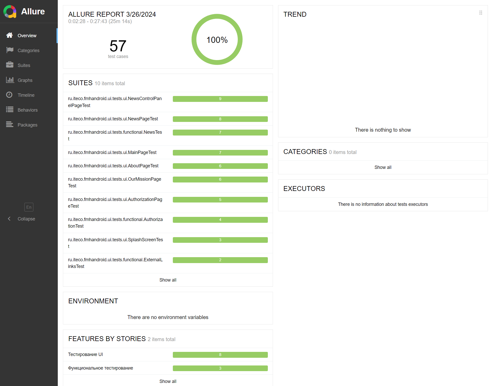
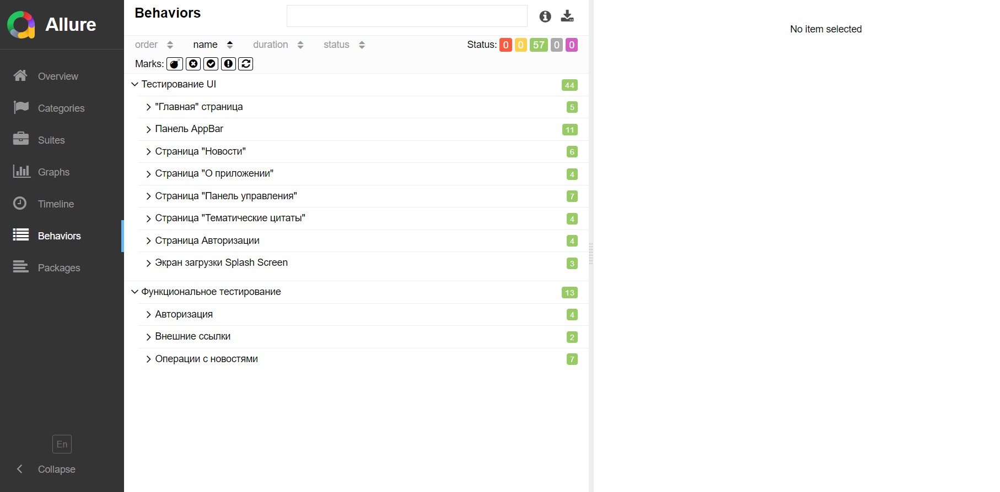

<h1>Отчет автоматизированного тестирования</h1>

<h2>Описание</h2>
В ходе тестирования была реализована часть позитивных тест-кейсов, которые описаны в файле 
  <a href="Cases.xlsx">Cases.xlsx</a> 
  - вкладка "test cases", которые проверяют отображение UI элементов, основных функций приложения, авторизации.
Суть тестирования заключается в автоматизации наиболее приоритетных позитивных тест-кейсов.

<h2>Сведения о ходе испытаний</h2>
В процессе проведения тестирования было реализовано 57 тест-кейсов. Из них: 

  <ul>
    <li>Успешно пройденных - 57 или 100%.</li>
    <li>Неудачных - 0 или 0%.</li>
    <figure>
      
        <figcaption>
          Скриншот Overview
        </figcaption>
    </figure>
    <figure>
       
        <figcaption>
          Скриншот Behaviors
        </figcaption>
    </figure>
  </ul>

<h2>Результаты испытаний</h2>
Проходит тест-кейс, который показывает ошибку. 
Написан на основе баг-репорта 
  <a href="https://github.com/Guzelechkin/diiiiplom/issues/3">
    На странице авторизации при вводе неверного логина или пароля сообщение отображает неверный текст</a>.
